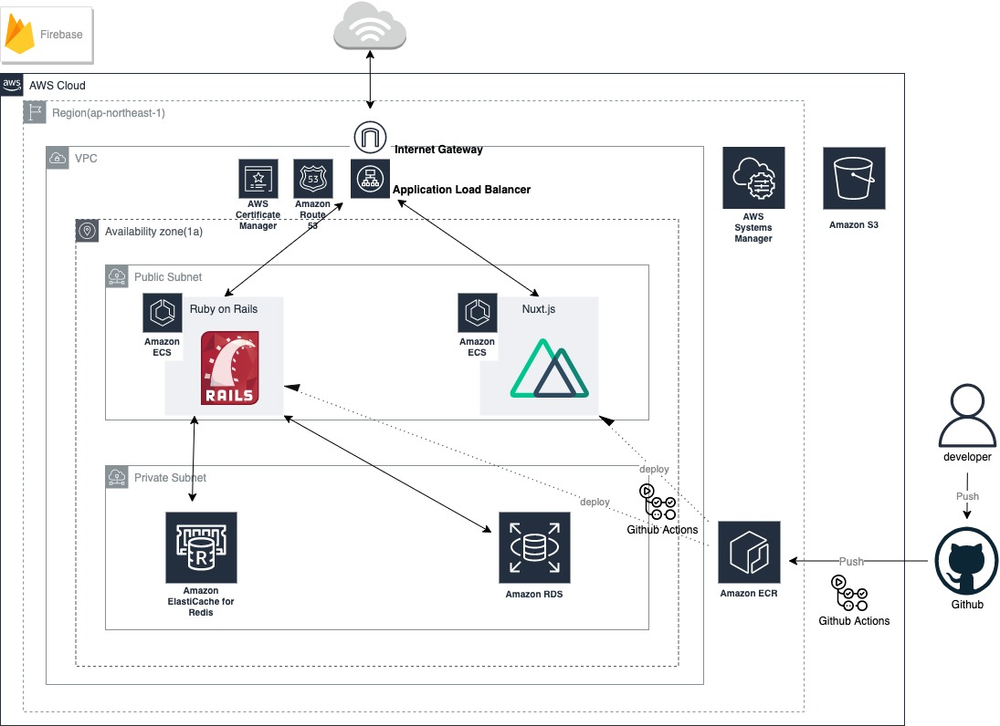
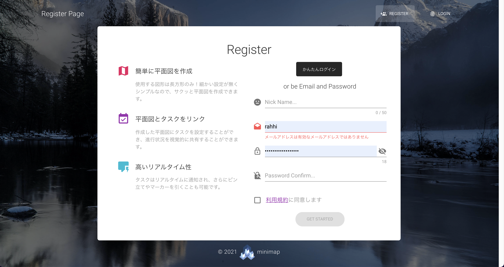
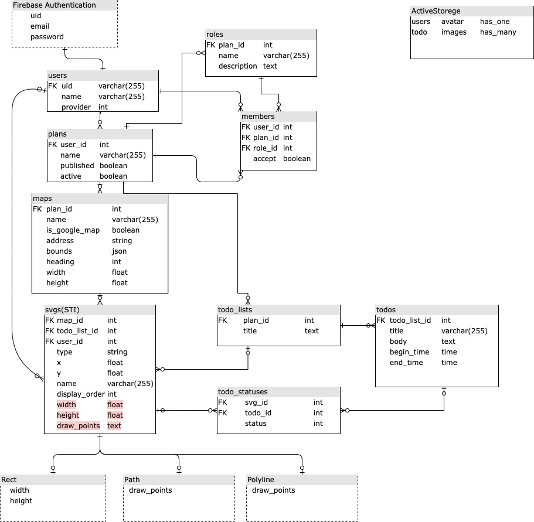

# minimap-portfolio
自作のポートフォリオアプリ「[ミニマップ](https://www.minimap.work)」のまとめリポジトリです。他のリポジトリは👇の３つ
- [NuxtJSのリポジトリ](https://github.com/rahhi555/portfolio-front/tree/master)
- [Railsのリポジトリ](https://github.com/rahhi555/portfolio-api/tree/master)
- [terraformのリポジトリ](https://github.com/rahhi555/portfolio-terraform/tree/master)

## サービス概要
現場で作業をする際に、離れた位置の人と仕事の進捗状況及び位置情報を共有できるサービスです。
長方形を組み合わせて作業地域の簡単な平面図を作成していただき、作業リストを図形と紐付けることで視覚的に進捗状況が分かるようになっています。またピン立てやマーカーを引くこともでき、リアルタイムに情報共有が可能です。

## 登場人物
エンドユーザー
- 清掃業や設営等の同時多発的に作業する人
- イベントのスタッフ
- イベントの来客者
- サバゲーマー

管理者
- 作業監督者
- イベント主催者

## ユーザーが抱える課題
作業を同時多発的に行う際にどこが終わっていてどこが終わっていないかわからない。それにより管理者は全体の把握が困難になり、人手不足の箇所に人員をアサインするといったことができなくなる。結果効率的に作業できなくなる。

## 解決方法
作業の進捗情報と位置情報を末端まで共有できるようにすることで、各々が次に何をやるべきかを認識でき、効率的に作業できるようになる。

## プロダクト
TODOリストと位置情報をリアルタイムに紐付ける。

## アプリを作ろうと思った経緯
前職で大規模イベントの作業員として招集されたことがありました。作業内容として会場の設営やお客様の誘導等があったのですが、トランシーバーで進捗状況や位置情報を正確に伝えるのは難しく、現場が混乱することもありました。そんな時にリアルタイムに連動する地図があればいいのにと思ったのがきっかけです。FPSのミニマップみたいな感じで、状態にあわせて建物図の色を変えたり、指定場所にピンを立てたりしたいなと思っています。

## 使用技術
- フロントエンド
  - NuxtJS(2.15.8)
  - TypeScript(4.2.4)
- バックエンド
  - Rails(6.0.4.1)
  - Ruby(3.0.2)
- データベース
  - MySQL(8.0.23)
  - Redis(6.0.5)
- 認証
  - firebase Authentication
- 開発環境
  - docker-compose
- インフラ
  - AWS ECS(Fargate)
  - terraform
- CD/CI
  - Github Actions

## インフラ構成図

## 機能
|ログイン|
|-|
||
|簡単ログインとGoogleログインを実装|

## ER図

一旦プッシュ
